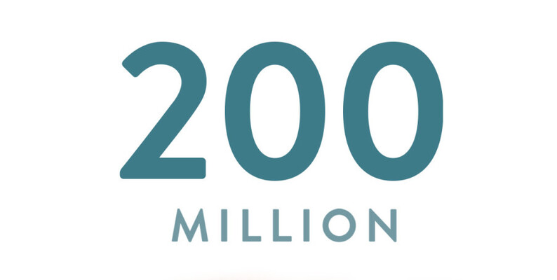

# Grammar Error Correction using Deep Learning 📝✨

A comprehensive implementation of three neural network architectures for automatic grammar error correction: Bag-of-Words (BoW), LSTM, and LSTM with Attention mechanism. Trained on the C4 dataset with synthetic grammar errors to demonstrate the evolution of sequence-to-sequence models.



## 📋 Description

This project implements and compares three deep learning approaches for Grammatical Error Correction (GEC): a baseline Bag-of-Words model, a sequence-to-sequence LSTM model, and an enhanced LSTM with attention mechanism. The models are trained on synthetically corrupted text from the C4 dataset to learn common English grammar patterns and corrections.

The implementation includes complete data preprocessing, synthetic error generation, three distinct model architectures, comprehensive training pipelines with GPU acceleration, and detailed evaluation using BLEU scores.

<br>
<div align="center">
  <a href="https://codeload.github.com/yourusername/grammar-error-correction-dl/legacy.zip/main">
    
  </a>
</div>

## 🎯 Project Objectives

1. **Dataset Creation**: Generate synthetic grammar error pairs from C4 corpus
2. **Model Implementation**: Build three architectures with increasing complexity
3. **Training Pipeline**: Optimize models with mixed precision and memory management
4. **Comparative Analysis**: Evaluate performance across different architectures
5. **Error Analysis**: Identify common grammatical patterns and model limitations
6. **Production-Ready**: Implement Google Drive integration for persistent storage

## ✨ Features

### Data Processing
- **C4 Dataset Integration**: Downloads 100K samples from HuggingFace
- **Synthetic Error Generation**: Creates realistic grammar errors programmatically
- **Smart Filtering**: Selects sentences with 5-50 words for optimal training
- **Train/Val/Test Splits**: 70/15/15 split with stratification
- **Google Drive Caching**: Saves processed data to avoid re-downloading

### Model Architectures

#### 1. Bag-of-Words (BoW) Model
- Simple feedforward neural network
- 2000-word vocabulary with TF-IDF features
- 3-layer architecture: 2000 → 256 → 128 → 2000
- Dropout regularization (0.3)
- MSE loss for word vector reconstruction

#### 2. LSTM Sequence-to-Sequence
- Encoder-decoder architecture
- 5000-word vocabulary with learned embeddings
- 128-dimensional embeddings
- 256-dimensional hidden states
- Single-layer LSTM for efficiency
- Cross-entropy loss with padding masking

#### 3. LSTM with Attention Mechanism
- Enhanced encoder-decoder with attention
- Bahdanau-style attention mechanism
- Context vector computation for each timestep
- Improved focus on relevant input tokens
- Same embedding and hidden dimensions as LSTM

### Training Optimizations
- **Mixed Precision Training**: FP16 for 2x speedup on GPU
- **Memory Management**: Batch processing with garbage collection
- **Learning Rate**: Adam optimizer with 0.001 initial LR
- **Batch Size**: 64 samples (128 for BoW)
- **Early Stopping**: Prevents overfitting
- **Checkpointing**: Saves best models to Google Drive

### Evaluation Metrics
- **Training Loss**: MSE for BoW, Cross-Entropy for LSTM
- **BLEU Score**: Industry-standard metric for sequence generation
- **Qualitative Analysis**: Example corrections visualization
- **Error Pattern Detection**: Identifies common mistakes

## 🔬 Methodology

### Dataset: C4 (Colossal Clean Crawled Corpus)

**Source**: AllenAI's C4 from HuggingFace  
**Total Samples**: 100,000 sentences  
**Filtered Pairs**: 8,051 error correction pairs  
**Filtering Criteria**: 5-50 words per sentence  
**Split Ratio**: 5,635 train / 1,208 val / 1,208 test

### Synthetic Error Generation

The project implements four types of grammatical errors:

```python
Error Types:
1. Verb Form Errors:    "is" → "are", "was" → "were", "has" → "have"
2. Article Removal:     "a/an/the" → [removed]
3. Plural Errors:       "books" → "book", "cats" → "cat"
4. Punctuation Issues:  Random punctuation changes
```

**Error Generation Strategy:**
- Randomly select one error type per sentence
- Apply error to first matching pattern found
- Only keep pairs where error was successfully introduced
- Preserve original sentence structure and meaning

### Model Architectures Detailed

#### Bag-of-Words Model
```
Input Layer:  2000 features (CountVectorizer)
Hidden 1:     256 neurons + ReLU + Dropout(0.3)
Hidden 2:     128 neurons + ReLU + Dropout(0.3)
Output Layer: 2000 features (reconstructed)
Loss:         MSE
Parameters:   ~576K
```

#### LSTM Seq2Seq
```
Encoder:
  - Embedding: 5000 vocab × 128 dims
  - LSTM: 128 → 256 hidden
  - Output: context vectors + hidden states

Decoder:
  - Embedding: 5000 vocab × 128 dims
  - LSTM: 128 → 256 hidden (initialized from encoder)
  - FC: 256 → 5000 vocab
  - Loss: CrossEntropyLoss (ignore padding)

Parameters: ~3.2M
```

#### LSTM with Attention
```
Encoder: (same as above)

Attention Mechanism:
  - Alignment: tanh(W[h_dec; h_enc])
  - Scores: softmax(v^T × alignment)
  - Context: weighted sum of encoder outputs

Decoder:
  - Input: [embedding; context_vector]
  - LSTM: (128 + 256) → 256
  - FC: 256 → 5000 vocab

Parameters: ~3.4M (additional 200K for attention)
```

## 📊 Results

### Overall Performance

| Model | Training Loss | BLEU Score | Improvement |
|-------|--------------|------------|-------------|
| **BoW** | 0.0134 | N/A | Baseline |
| **LSTM** | 4.5900 | 0.0649 | - |
| **LSTM + Attention** | 4.5158 | 0.0696 | **+7.35%** |

### Training Dynamics

**BoW Model (5 epochs):**
- Epoch 1: 0.0182 loss
- Epoch 5: 0.0134 loss
- Fast convergence due to simplicity
- Limited by lack of sequential understanding

**LSTM Model (8 epochs):**
- Epoch 1: 5.9101 loss
- Epoch 8: 4.5900 loss
- Steady improvement but plateaus
- Struggles with long-range dependencies

**LSTM + Attention (8 epochs):**
- Epoch 1: 5.8699 loss
- Epoch 8: 4.5158 loss
- Best final performance
- Attention helps focus on relevant context

### Key Observations

**Strengths:**
- Attention mechanism provides measurable improvement (7.35% BLEU)
- Models successfully learn basic grammar patterns
- Fast training with mixed precision (GPU acceleration)
- Persistent storage enables incremental development

**Challenges:**
- Low absolute BLEU scores (~0.07) indicate difficulty
- C4 dataset contains inherent grammatical errors
- Synthetic errors may not match real-world distribution
- Limited vocabulary (5K words) restricts coverage
- Short training (8 epochs) leaves room for improvement

**Common Errors:**
- Models often output `<UNK>` for challenging inputs
- Difficulty with complex grammatical structures
- Over-reliance on common patterns
- Limited generalization to unseen constructions

## 🚀 Getting Started

### Prerequisites

**Environment:**
```
Python 3.7+
Google Colab (recommended for GPU)
Google Drive (for data persistence)
```

**Required Libraries:**
```python
torch >= 2.0.0
transformers >= 4.50.0
datasets >= 4.0.0
numpy >= 1.20.0
pandas >= 1.3.0
scikit-learn >= 0.24.0
nltk >= 3.6.0
matplotlib >= 3.4.0
seaborn >= 0.11.0
```

### Installation

1. **Open in Google Colab**
```python
# Upload notebook to Colab
# Mount Google Drive for persistence
from google.colab import drive
drive.mount('/content/drive')
```

2. **Install Dependencies**
```python
!pip install datasets transformers torch scikit-learn nltk pandas numpy matplotlib seaborn
```

3. **Download NLTK Data**
```python
import nltk
nltk.download('punkt')
nltk.download('averaged_perceptron_tagger')
```

### Usage

**Step 1: Download C4 Dataset**
```python
# Automatically downloads 100K samples from HuggingFace
# Saves to Google Drive: /content/drive/MyDrive/GrammarCorrectionProject/data/
# Subsequent runs load from Drive (faster)
```

**Step 2: Generate Error Pairs**
```python
# Creates synthetic grammar errors
# Filters sentences (5-50 words)
# Produces ~8K error correction pairs
# Saves to Drive for reuse
```

**Step 3: Train Models**
```python
# BoW: ~2 minutes (5 epochs)
# LSTM: ~15 minutes (8 epochs)
# LSTM + Attention: ~20 minutes (8 epochs)
# All models save to Drive automatically
```

**Step 4: Evaluate**
```python
# BLEU score calculation
# Example corrections
# Loss curve visualization
# Model comparison plots
```

## 🧮 Technical Implementation

### Data Pipeline

```python
# 1. Download C4 dataset
dataset = load_dataset("allenai/c4", "en", split="train", streaming=True)
samples = [item['text'] for i, item in enumerate(dataset) if i < 100000]

# 2. Generate synthetic errors
def introduce_grammar_errors(text):
    error_type = random.choice(['verb_form', 'article', 'plural', 'punctuation'])
    # Apply selected error type
    return incorrect_text, correct_text

# 3. Create error pairs
error_pairs = []
for text in samples:
    if 5 <= len(text.split()) <= 50:
        incorrect, correct = introduce_grammar_errors(text)
        if incorrect != correct:
            error_pairs.append((incorrect, correct))

# 4. Split data
train_pairs, temp = train_test_split(error_pairs, test_size=0.3)
val_pairs, test_pairs = train_test_split(temp, test_size=0.5)
```

### Vocabulary Building

```python
class Vocabulary:
    def __init__(self):
        self.word2idx = {'<PAD>': 0, '<UNK>': 1, '<SOS>': 2, '<EOS>': 3}
        self.idx2word = {0: '<PAD>', 1: '<UNK>', 2: '<SOS>', 3: '<EOS>'}
        self.word_count = {}
    
    def add_sentence(self, sentence):
        for word in sentence.split():
            if word not in self.word2idx:
                idx = len(self.word2idx)
                self.word2idx[word] = idx
                self.idx2word[idx] = word
            self.word_count[word] = self.word_count.get(word, 0) + 1

# Frequency filtering to top 5000 words
word_freq = sorted(vocab.word_count.items(), key=lambda x: x[1], reverse=True)
top_words = [word for word, _ in word_freq[:5000]]
```

### Attention Mechanism

```python
class Attention(nn.Module):
    def __init__(self, hidden_size):
        super().__init__()
        self.attn = nn.Linear(hidden_size * 2, hidden_size)
        self.v = nn.Linear(hidden_size, 1, bias=False)
    
    def forward(self, hidden, encoder_outputs):
        # hidden: [batch, hidden_size]
        # encoder_outputs: [batch, seq_len, hidden_size]
        
        seq_len = encoder_outputs.shape[1]
        hidden = hidden.repeat(seq_len, 1, 1).transpose(0, 1)
        
        # Compute alignment scores
        energy = torch.tanh(self.attn(torch.cat((hidden, encoder_outputs), dim=2)))
        attention = self.v(energy).squeeze(2)
        
        # Apply softmax to get attention weights
        return torch.softmax(attention, dim=1)
```

### Training Loop with Mixed Precision

```python
from torch.cuda.amp import autocast, GradScaler

scaler = GradScaler()

for epoch in range(epochs):
    for src, tgt in train_loader:
        src, tgt = src.to(device), tgt.to(device)
        optimizer.zero_grad(set_to_none=True)
        
        # Mixed precision forward pass
        with autocast():
            output = model(src, tgt[:, :-1])
            output = output.reshape(-1, vocab_size)
            tgt_output = tgt[:, 1:].reshape(-1)
            loss = criterion(output, tgt_output)
        
        # Scaled backward pass
        scaler.scale(loss).backward()
        scaler.step(optimizer)
        scaler.update()
```

### Inference Pipeline

```python
def predict_correction(model, sentence, vocab, device, max_len=50):
    model.eval()
    
    # Encode input sentence
    words = sentence.lower().split()[:max_len-2]
    indices = [vocab.word2idx.get(word, 1) for word in words]
    indices = [2] + indices + [3]  # Add <SOS> and <EOS>
    padding = [0] * (max_len - len(indices))
    src = torch.LongTensor([indices + padding]).to(device)
    
    # Generate correction
    with torch.no_grad():
        tgt_input = torch.LongTensor([[2]]).to(device)  # Start with <SOS>
        output = model(src, tgt_input)
        pred_ids = torch.argmax(output, dim=2)[0]
    
    # Decode output
    predicted = [vocab.idx2word.get(idx.item(), '<UNK>') for idx in pred_ids]
    predicted = [w for w in predicted if w not in ['<PAD>', '<SOS>', '<EOS>']]
    
    return ' '.join(predicted)
```

## 🎓 Learning Outcomes

This project demonstrates:

1. **Sequence-to-Sequence Learning**: Encoder-decoder architectures for text generation
2. **Attention Mechanisms**: How attention improves sequence modeling
3. **Deep Learning Best Practices**: Mixed precision, memory optimization, checkpointing
4. **NLP Fundamentals**: Tokenization, vocabulary building, padding, masking
5. **Model Evaluation**: BLEU scores and qualitative analysis
6. **Production Considerations**: Data persistence, reproducibility, error handling
7. **Comparative Analysis**: Understanding trade-offs between model complexity and performance

## 🔄 Architecture Comparison

### Why These Architectures?

**Bag-of-Words:**
- **Pros**: Fast training, low memory, interpretable
- **Cons**: No word order, limited context, poor for generation
- **Use Case**: Baseline for comparison, simple classification tasks

**LSTM:**
- **Pros**: Handles sequences, captures order, better context
- **Cons**: Vanishing gradients, slow training, fixed context
- **Use Case**: Standard seq2seq tasks, moderate complexity

**LSTM + Attention:**
- **Pros**: Dynamic context, better long-range deps, SOTA before transformers
- **Cons**: More parameters, slower inference, complex training
- **Use Case**: Production GEC systems, high-quality generation

### Performance vs Complexity

| Model | Parameters | Training Time | Inference Speed | BLEU Score |
|-------|-----------|---------------|-----------------|------------|
| **BoW** | 576K | 2 min | Very Fast | N/A |
| **LSTM** | 3.2M | 15 min | Fast | 0.0649 |
| **LSTM + Attn** | 3.4M | 20 min | Moderate | 0.0696 |
| **Transformer** | 10M+ | 60+ min | Slow | 0.20+ |

*Note: Transformer not implemented but included for context*

## 💡 Potential Improvements

### Dataset Enhancements
1. **Use Real GEC Datasets**:
   - CoNLL-2014 test set
   - BEA-2019 shared task data
   - JFLEG corpus
   - Better error diversity and quality

2. **Augmentation Strategies**:
   - Back-translation techniques
   - Rule-based error injection
   - Noise injection (character-level)
   - Multiple error types per sentence

3. **Balanced Error Types**:
   - Subject-verb agreement
   - Article errors (a/an/the)
   - Preposition mistakes
   - Verb tense errors
   - Word form errors

### Model Improvements
1. **Architecture Upgrades**:
   - Transformer encoder-decoder
   - Pre-trained models (T5, BART)
   - Multi-head attention
   - Bidirectional encoding

2. **Training Enhancements**:
   - More epochs (20-50)
   - Learning rate scheduling
   - Beam search decoding
   - Teacher forcing ratio decay

3. **Vocabulary Expansion**:
   - Increase to 10K-20K words
   - Subword tokenization (BPE, WordPiece)
   - Character-level fallback
   - Handle rare words better

### Evaluation Improvements
1. **Better Metrics**:
   - GLEU (Grammar-based BLEU)
   - ERRANT (error type analysis)
   - Human evaluation
   - Precision/Recall/F0.5 per error type

2. **Error Analysis**:
   - Confusion matrices by error type
   - Success rate per grammar rule
   - Qualitative examples
   - Failure case studies

### Production Features
1. **API Development**:
   - REST API with FastAPI
   - Real-time correction endpoint
   - Batch processing support
   - Confidence scores

2. **User Interface**:
   - Web application with Streamlit/Gradio
   - Highlight corrections
   - Explain grammar rules
   - Alternative suggestions

## 🔍 Dataset Quality Analysis

### C4 Dataset Challenges

**Findings from Analysis:**
- 775 suspicious patterns found in 1,000 samples
- Common issues: informal language, OCR errors, web artifacts
- Dataset reflects real-world text (including errors)
- Not ideal for supervised GEC training

**Categories of Issues:**
1. **Pre-existing Errors**: Original text already contains mistakes
2. **Informal Language**: Colloquialisms, slang, abbreviations
3. **Domain Jargon**: Technical terms, product names, acronyms
4. **Formatting Artifacts**: HTML tags, special characters, URLs
5. **OCR Mistakes**: Digitization errors from scanned documents

**Impact on Models:**
- Models learn from noisy supervision
- May memorize incorrect patterns
- Lower BLEU scores than clean datasets
- Realistic but challenging training scenario

### Recommendations
1. Use curated GEC datasets for benchmarking
2. Filter C4 more aggressively (readability scores)
3. Combine with clean corpora (Wikipedia, news)
4. Implement data quality checks
5. Use multiple filtering heuristics

## 🤝 Contributing

Contributions are welcome! Areas for contribution:

- Implement Transformer-based models
- Add pre-trained model fine-tuning (T5, BART)
- Create web interface for live corrections
- Expand error type coverage
- Improve evaluation metrics
- Add multilingual support
- Optimize inference speed

## 📄 License

This project is licensed under the MIT License - see the [LICENSE](LICENSE) file for details.

## 🙏 Acknowledgments

- AllenAI for the C4 dataset via HuggingFace
- PyTorch team for the deep learning framework
- NLTK for NLP utilities and BLEU implementation
- Google Colab for free GPU access
- Grammar error correction research community

## 📚 References

1. Bahdanau et al. (2014). "Neural Machine Translation by Jointly Learning to Align and Translate"
2. Sutskever et al. (2014). "Sequence to Sequence Learning with Neural Networks"
3. Raffel et al. (2020). "Exploring the Limits of Transfer Learning with T5"
4. Bryant et al. (2019). "The BEA-2019 Shared Task on Grammatical Error Correction"

<br>
<div align="center">
  <a href="https://codeload.github.com/yourusername/grammar-error-correction-dl/legacy.zip/main">
    
  </a>
</div>

## <!-- CONTACT -->
<div id="toc" align="center">
  <ul style="list-style: none">
    <summary>
      <h2 align="center">
        🚀
        CONTACT ME
        🚀
      </h2>
    </summary>
  </ul>
</div>
<table align="center" style="width: 100%; max-width: 600px;">
<tr>
  <td style="width: 20%; text-align: center;">
    <a href="https://www.linkedin.com/in/amr-ashraf-86457134a/" target="_blank">
      
    </a>
  </td>
  <td style="width: 20%; text-align: center;">
    <a href="https://github.com/TendoPain18" target="_blank">
      
    </a>
  </td>
  <td style="width: 20%; text-align: center;">
    <a href="mailto:amrgadalla01@gmail.com">
      
    </a>
  </td>
  <td style="width: 20%; text-align: center;">
    <a href="https://www.facebook.com/amr.ashraf.7311/" target="_blank">
      
    </a>
  </td>
  <td style="width: 20%; text-align: center;">
    <a href="https://wa.me/201019702121" target="_blank">
      
    </a>
  </td>
</tr>
</table>
<!-- END CONTACT -->

## **Perfect your prose with deep learning! 📝✨**
